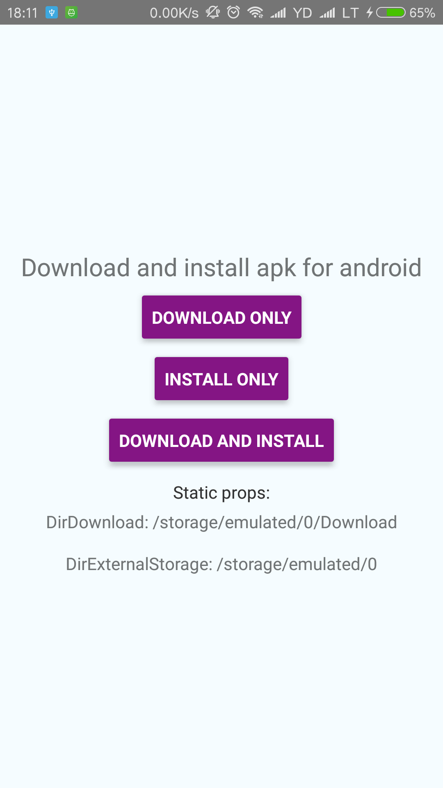
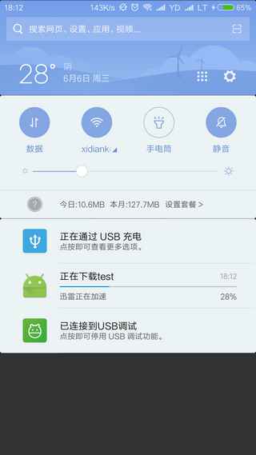

# react-native-easy-downloader

A downloadManager for react-native to use system downloadManager(Show download progress in notifications) and install apk files on android.

Support multitasking and each task will have its own promise(callback).





## Add it to your project

`$ npm install  react-native-easy-downloader --save `

Then you can try linking the project automatically:

`$ react-native link react-native-easy-downloader `

or do it manually as described below:

#### Android

1. in `android/settings.gradle`
```
...
include ':react-native-easy-downloader'
project(':react-native-easy-downloader').projectDir = new File(rootProject.projectDir, '../node_modules/react-native-easy-downloader/android')
```

2. in `android/app/build.gradle` add:
```
dependencies {
    ...
    compile project(':react-native-easy-downloader')
}
```

3. and finally, in `android/src/main/java/com/{YOUR_APP_NAME}/MainApplication.java` add:
```java
//...
import com.mayenjoy.RNDownloadManager.RNDownloadManager; // <--- This!
//...
@Override
protected List<ReactPackage> getPackages() {
  return Arrays.<ReactPackage>asList(
    new MainReactPackage(),
    new RNDownloadManager() // <---- and This!
  );
}
```

## Permissions

```
<uses-permission android:name="android.permission.WRITE_EXTERNAL_STORAGE"/>
<uses-permission android:name="android.permission.READ_EXTERNAL_STORAGE"/>
```

## API

### Constants

The following constants are available on the `RNFS` export:

- `DirDownload` (`String`) The absolute path to the system download directory
- `DirExternalStorage` (`String`) The absolute path to the external storage, shared directory 

### `download(options: object): Promise<path"">`

```
options = {
  url: string;    // Reqired. URL to download file from
  title: string;     // Optional. The download title, will show in the notifications
  description: string;     // Optional. The download description
  savePath: string;     // Optional. Default the caches directory
  isAutoInstall: boolean;     // Optional. Default false. Whether install apk files after download finished (apk files only)
};
```

### `installApk(path: string): Promise`

```
path: The path of apk file
```

## Examples

### Simple

```javascript
import RNDM from 'react-native-easy-downloader';

const testUrl = 'http://img.rulili.com/xuanpin/software/1806/qhz_v2.0.5_20180606_update.apk';

// Within your render function
<View>
  <Button
    onPress={() => {
      RNDM.download({
        url: testUrl,
      }).then(
        ret => Alert.alert('Success', ret)
      ).catch (
        err => Alert.alert('Something wrong', err.message)
      )
    }}
    title="Download only"
    color="#841584"
  />

  <Button
    onPress={() => {
      RNDM.installApk('test').then(
        // success
      ).catch (
        err => Alert.alert('Something wrong', err.message)
      )
    }}
    title="Install only"
    color="#841584"
  />

  <Button
    onPress={() => {
      RNDM.download({
        url: testUrl,
        autoInstall: true,
        savePath: RNDM.DirDownload + '/test.apk',
        title: 'test',
        description: 'v2.0.5',
      }).then(
        ret => console.log('Success', ret)
      ).catch (
        err => Alert.alert('Something wrong', err.message)
      )
    }}
    title="Download and install"
    color="#841584"
  />

  <Text>Props:</Text>
  <Text>DirDownload: {RNDM.DirDownload}</Text>
  <Text>DirExternalStorage: {RNDM.DirExternalStorage}</Text>
</View>

```

### License

License is MIT
